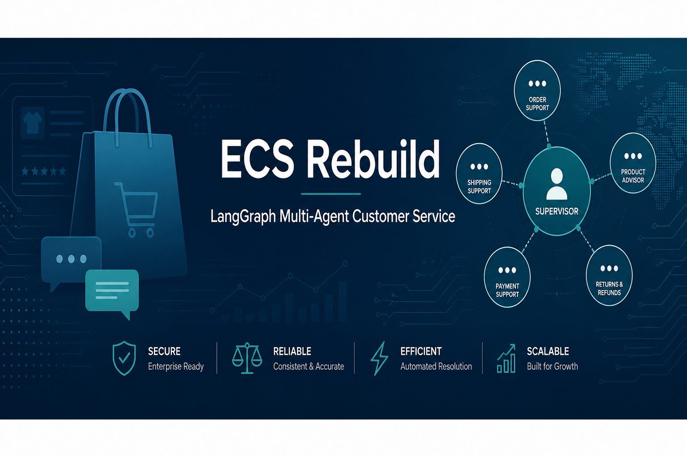

<p align="center">
  
</p>

<p align="center">
  <a href="README.md"></a>
  &nbsp;
  <a href="README.en.md"></a>
</p>

---

# ECS Rebuild — Scheme A (LangGraph Multi-Agent)

**Enterprise e-commerce customer-service** Scheme A: **LangGraph Supervisor + specialist agents** for dialog, **Tools** for business I/O, and **GraphRAG** for product knowledge Q&A.

> Local path: `ecs-rebuild`  
> Roadmap: A (this repo) → B (Temporal workflows) → C (domain microservices)

## Architecture

```text
Channel / Client
       │
       ▼
┌──────────────────┐
│ FastAPI Gateway  │  POST /v1/chat
└────────┬─────────┘
         ▼
┌──────────────────┐
│ LangGraph        │  Supervisor routing
│ Orchestrator     │  → order / logistics / postsale / knowledge / chitchat
│ + Checkpointer    │  memory | sqlite | postgres
└────────┬─────────┘
         ├──────── Domain Tools (MySQL)
         └──────── GraphRAG (Neo4j + Embedding)
```

## Capability Mapping

| Original Rasa | Scheme A |
|---------------|----------|
| CALM flows | LangGraph nodes + ReAct agents |
| `actions/*` | `apps/tools/*` |
| EnterpriseSearch / GraphRAG | `apps/knowledge/graphrag.py` |
| REST channel | FastAPI `/v1/chat` |
| In-memory tracker | LangGraph checkpointer |

Coverage: order query / address change / cancel, logistics tracking & complaints, refund / return / exchange, product knowledge Q&A, chitchat fallback.

## Layout

```text
ecs-rebuild/
├── apps/
│   ├── gateway/          # FastAPI entry
│   ├── orchestrator/     # LangGraph orchestration & agents
│   ├── tools/            # Order / logistics / postsale tools
│   └── knowledge/        # GraphRAG
├── packages/shared/      # Config, SQLAlchemy ORM
├── docs/assets/          # README assets (banner, etc.)
├── infra/                # Architecture notes
├── tests/
├── docker-compose.yml
├── Dockerfile
└── requirements.txt
```

## Quick Start

### 1. Prerequisites

- Python 3.10+
- MySQL 8 (e-commerce DB, default name `ecs`)
- Neo4j 5 (optional, for product knowledge Q&A)
- DashScope API Key
- Embedding service (OpenAI-compatible, default `http://127.0.0.1:10010/v1`)

```bash
cd ecs-rebuild
python -m venv .venv
# Windows
.venv\Scripts\activate
pip install -r requirements.txt
copy .env.example .env
```

Edit `.env` and set at least `API_KEY`, `DB_*`, and `NEO4J_*`.

### 2. Run

```bash
# from ecs-rebuild root
set PYTHONPATH=.
uvicorn apps.gateway.main:app --host 0.0.0.0 --port 8080 --reload
```

### 3. Call the API

```bash
curl -X POST http://127.0.0.1:8080/v1/chat ^
  -H "Content-Type: application/json" ^
  -d "{\"message\": \"Help me check my orders\", \"user_id\": \"1\", \"thread_id\": \"demo-1\"}"
```

Health check: `GET /health`

### 4. Docker (optional)

```bash
docker compose up -d --build
```

Note: Compose starts empty MySQL/Neo4j. Import the same business data and graph indexes as the original project.

## API

| Method | Path | Description |
|--------|------|-------------|
| GET | `/health` | Health check |
| POST | `/v1/chat` | Multi-turn chat; reuse the same `thread_id` |

Request body:

```json
{
  "message": "Track my shipment",
  "user_id": "1",
  "thread_id": "session-001"
}
```

## Next Schemes

- **Scheme B**: Emit Temporal commands for `cancel_order` / `commit_postsale` / `update_order_receive_info`; agents only clarify and confirm.
- **Scheme C**: Extract `apps/tools` into standalone Order / Logistics / Postsale / Knowledge microservices; Gateway and Orchestrator only coordinate.
